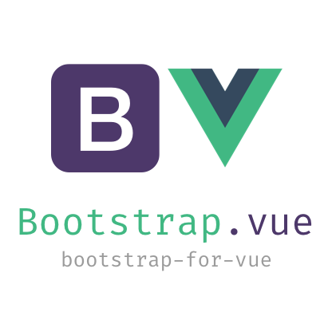

<div class="text-xs-center" align="center" style="margin: 20px">
  
</div>

<div style="text-align: center">
  [](https://www.npmjs.com/package/bootstrap-for-vue)
  [](https://vuejs.org/)
</div>

## Introduction
**Bootstrap for Vue** is collection of bootstrap 4 based reusable components, (no jquery, no tether, no bootstrap.js). It is used by 
[Vue Issue](https://new-issue.vuejs.org) and [Zero](https://zero.institute).


> Looking to contribute? Take up a task from [Dev Board](https://github.com/znck/bootstrap-for-vue/projects/1)

## Documentation
http://bootstrap-for-vue.znck.me/

## Development

### Launch visual tests

```bash
npm run dev
```

### Launch Karma with coverage

```bash
npm run dev:coverage
```

### Build

Bundle the js and css of to the `dist` folder:

```bash
npm run build
```

## License

[MIT](http://opensource.org/licenses/MIT)
